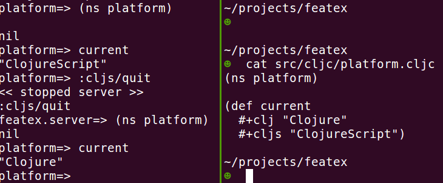

# How to try Clojure's feature expressions today

[Feature Expressions](http://dev.clojure.org/display/design/Feature+Expressions) are coming to Clojure and ClojureScript. You will have to build your own patched versions, these are instructions on how to do that.

Follow these steps or just do `sh try_feature_expressions.sh`

Grab Clojure, ClojureScript and tools.reader

```
git clone git@github.com:clojure/clojure.git
git clone git@github.com:clojure/clojurescript.git
git clone git@github.com:clojure/tools.reader.git
```

Patch, build, install

```
cd clojure
git apply ../clojure.diff
./antsetup.sh
mvn install

cd tools-reader
git apply ../tools.reader.diff
lein install

cd clojurescript
git apply ../clojurescript.diff
lein install
```

These patches contain custom version numbers to differentiate them. These are the version vectors:

```clojure
[org.clojure/clojure "1.7.0-fx"]
[org.clojure/clojurescript "0.0-9999"]
[org.clojure/tools.reader "0.8.13-fx"]
```

(adding -fx to the clojurescript version doesn't work, `cljsbuild.compat/parse-version` will choke on it)

Now use the versions above in your `project.clj`, and add a `cljc` directory to your `:source-paths`.

Have a look at the `featex` directory for an example app.


